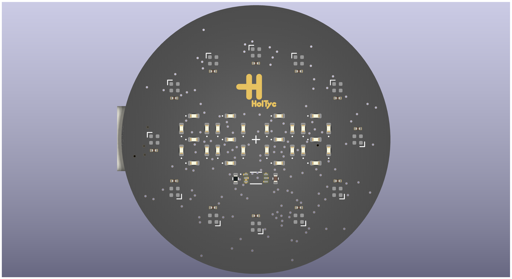
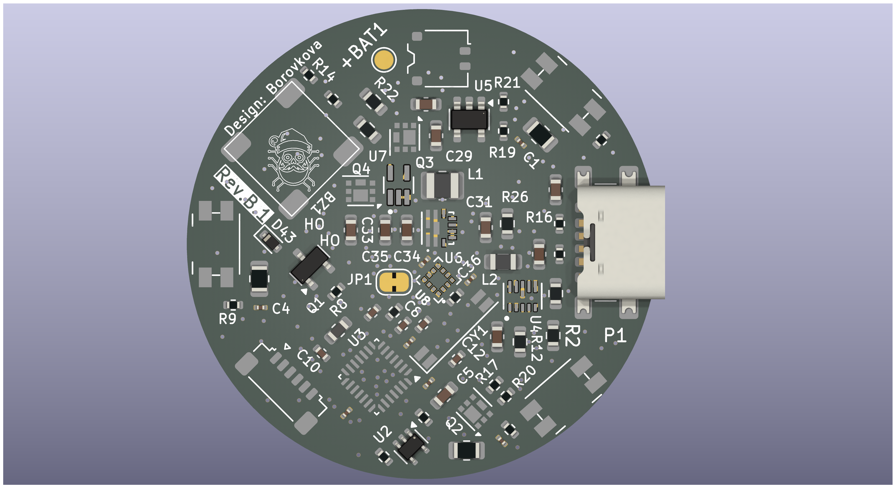
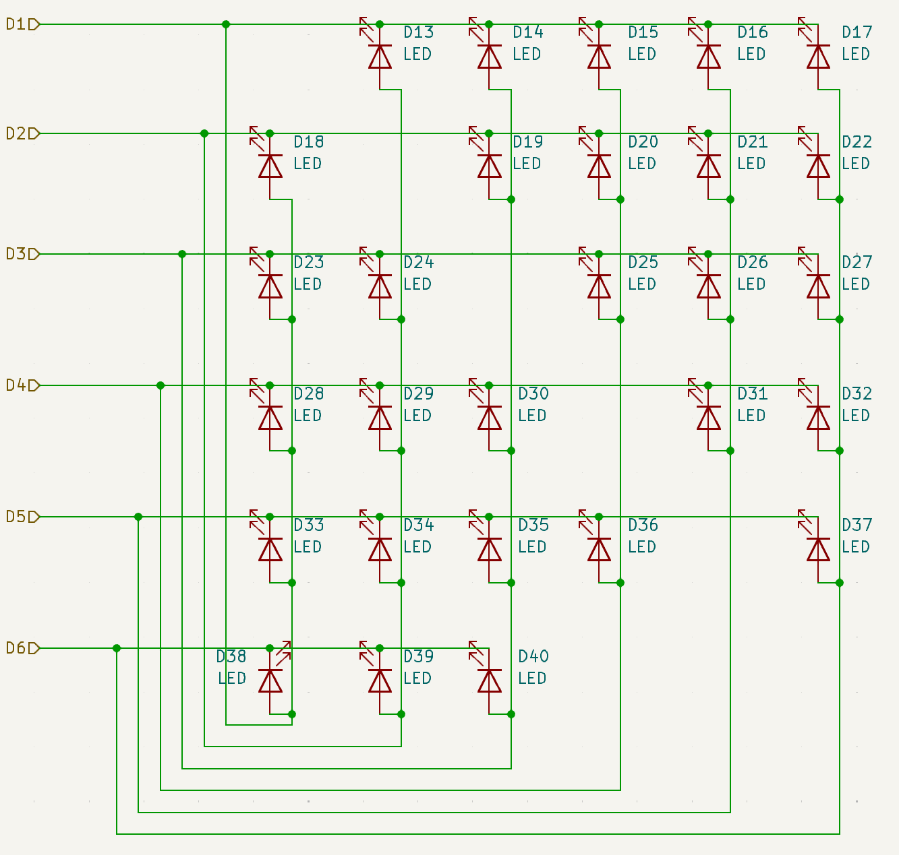
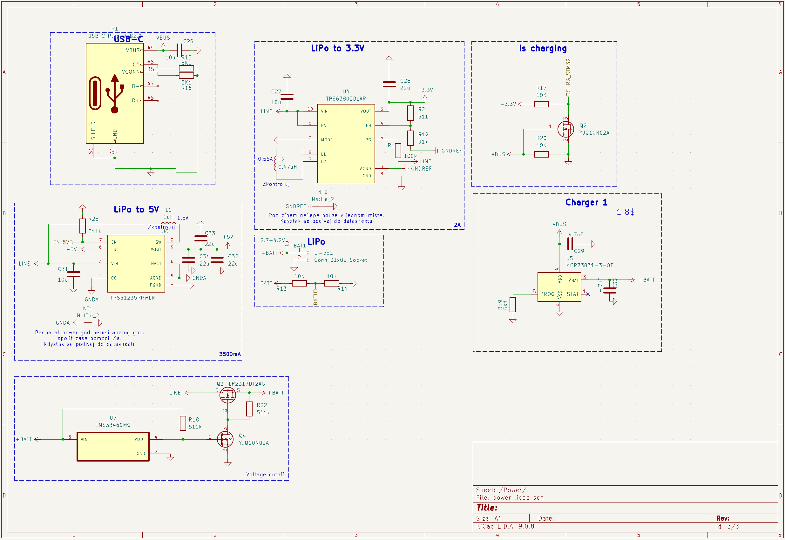

# HolTyc Smartwatch

A smartwatch designed and engineered from scratch by Czech students. This is a hobby project intended to help others build their own PCB-based watches.

| Front | Back |
|:-----:|:----:|
|  |  |

---

## Features

- **Analog clock** — 12 addressable RGB LEDs (WS2812B) arranged in a clock ring
- **Digital clock** — HH:MM shown on a custom 7-segment display built using **Charlieplexing** (6 GPIO pins drive a 4-digit matrix with no external drivers)
- **Wrist-wake** — BMA400 accelerometer detects wrist raise, wakes the watch from sleep
- **Auto-brightness** — BH1750FVI ambient light sensor adjusts LED brightness automatically
- **6 color themes** — cycle through hour/minute color combinations
- **Time setting** — set time directly on the watch via buttons
- **Shooting mini-game** — hidden game accessible via simultaneous button press
- **Battery monitoring** — color-coded charging display
- **Ultra-low power** — STM32 STOP mode between interactions; RTC runs from LSE crystal

---

## Repository Structure

```
STM32_watch_NFC/
├── Firmware/               # STM32CubeIDE project (all firmware source code)
│   └── Core/
│       ├── Inc/            # Header files (main.h, BMA400.h, Din_LED.h, …)
│       └── Src/            # Source files (main.c, BMA400.c, Din_LED.c, …)
├── PCB/                    # KiCad project — schematic and PCB layout
│   └── STM32_watch_NFC/    # Main KiCad project files (.kicad_pcb, .kicad_sch, gerbers)
├── Firmware_old/           # Legacy firmware from earlier revisions (deprecated)
├── Datasheets_components/  # Datasheets for key ICs (STM32, BMA400, TPS63802, …)
├── HW_design/              # Hardware design notes and segment layout diagrams
├── Fotos/                  # PCB renders and design visuals
└── README.md
```

---

## Hardware

| Component | Part | Notes |
|-----------|------|-------|
| MCU | STM32L031G6U6 | Cortex-M0+, 32KB Flash, 8KB RAM |
| RGB LEDs | 12× WS2812B | Driven via TIM2 PWM + DMA |
| Display | Charlieplex matrix | 6 pins → 4-digit 7-segment (no external drivers) |
| Accelerometer | BMA400 | Wrist-wake via orientation interrupt |
| Light sensor | BH1750FVI | Auto-brightness (I2C) |
| Power converter | TPS63802 | Buck-boost regulator |
| RTC crystal | 32.768 kHz LSE | Accurate timekeeping in sleep |
| Buzzer | Passive | ~2.7 kHz tone |

The HH:MM display is built entirely with Charlieplexing — 6 GPIO pins control a 4-digit 7-segment matrix with no shift registers or external display drivers.



### Power Schematic



> **Note:** The PCB had NFC hardware (ST25R3916B antenna area), but NFC functionality was scrapped during development. No NFC code exists in the firmware.

---

## Getting Started

### Requirements

- [STM32CubeIDE](https://www.st.com/en/development-tools/stm32cubeide.html) (recommended: 1.14+)
- ST-Link programmer (or compatible SWD debugger)
- The watch hardware (or a compatible STM32L031 dev board for partial testing)

### Import & Build

1. Open STM32CubeIDE.
2. Go to **File → Import → General → Existing Projects into Workspace**.
3. Set the root directory to `Firmware/` and select the project.
4. Click **Finish**.
5. Build with **Project → Build Project** (or `Ctrl+B`).

### Flash

1. Connect your ST-Link to the watch via the SWD pads on the PCB.
2. In STM32CubeIDE, go to **Run → Debug Configurations** and select the ST-Link configuration.
3. Click **Debug** (or **Run**) to flash and start.

Alternatively, flash the compiled `.elf` / `.bin` from `Firmware/Debug/` using **STM32CubeProgrammer**.

### First Boot

- The RTC starts paused at 00:00:00. Set the time via **Button_R long-press** → enter `changeTime` mode.
- Time resets on power loss (no backup registers).

---

## Button Reference

| Button | Short press | Long press (≥1 s) |
|--------|-------------|-------------------|
| Button_R | Show RGB analog clock | Enter time-set mode |
| Button_LT | Show digital clock | Enter charging display |
| Button_LB | Show digital clock | Cycle color theme |
| Button_R + Button_LB | Enter shooting game | — |

---

## PCB

KiCad source files are in `PCB/STM32_watch_NFC/`. Gerber files ready for manufacturing are in `PCB/STM32_watch_NFC/gerber/`. A panelized version is available in `PCB/Panelized_watch/`.

---

## License

MIT License

Copyright (c) 2025 HolTyc

Permission is hereby granted, free of charge, to any person obtaining a copy of this software and associated documentation files (the "Software"), to deal in the Software without restriction, including without limitation the rights to use, copy, modify, merge, publish, distribute, sublicense, and/or sell copies of the Software, and to permit persons to whom the Software is furnished to do so, subject to the following conditions:

The above copyright notice and this permission notice shall be included in all copies or substantial portions of the Software.

THE SOFTWARE IS PROVIDED "AS IS", WITHOUT WARRANTY OF ANY KIND, EXPRESS OR IMPLIED, INCLUDING BUT NOT LIMITED TO THE WARRANTIES OF MERCHANTABILITY, FITNESS FOR A PARTICULAR PURPOSE AND NONINFRINGEMENT. IN NO EVENT SHALL THE AUTHORS OR COPYRIGHT HOLDERS BE LIABLE FOR ANY CLAIM, DAMAGES OR OTHER LIABILITY, WHETHER IN AN ACTION OF CONTRACT, TORT OR OTHERWISE, ARISING FROM, OUT OF OR IN CONNECTION WITH THE SOFTWARE OR THE USE OR OTHER DEALINGS IN THE SOFTWARE.
